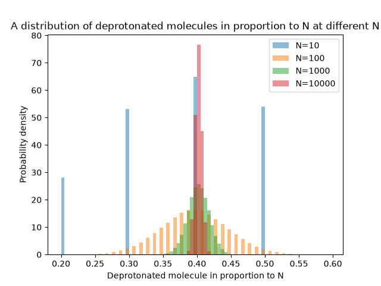
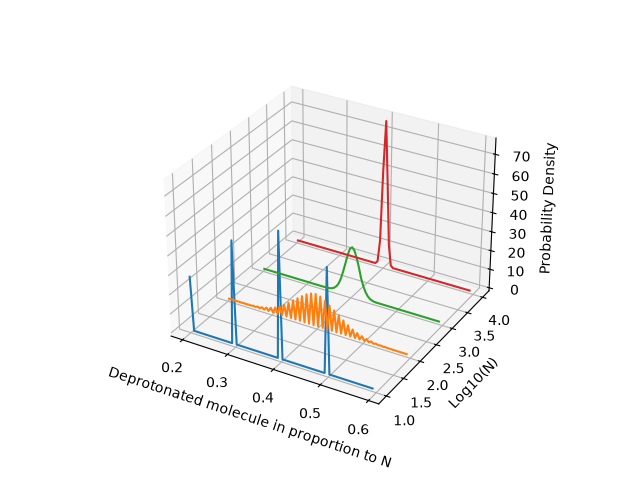

# Gillespie algorithm approach to Acid-Base indicator equilibrium against traditional deterministic ODE approach 
A stochastic simulation of acid-base indicator equilibrium via Gillespie algorithm, verified against UV-Vis measurement data and compared against traditional deterministic ODE.  

Key Figures: 

 

The pKa of the solutions are found via UV-Vis measurements. The Ka is then derived from this. After obtaining all necessary values (Ka, forward rate constant and reverse rate constant), the Gillespie model is then parametised and ran with different counts of N. The resultant graphs validate the theory that the distributions concentrate towards N*p where N is total molecule count and p is probability of a molecule being the desired (deprotonated) molecule. 

The stationary count distribution i.e. the distribution mentioned above, is a binomial distribution B(N, p) with p=0.402 and as observed in the convergence sweep figure, the relative width of distributions is inversley proportional to $\sqrt{N}$. 

How to run:

Install dependencies with pip install -r requirements.txt, then run script.py

Please see [Full Write Up](A) for full theory and analysis of this project.
